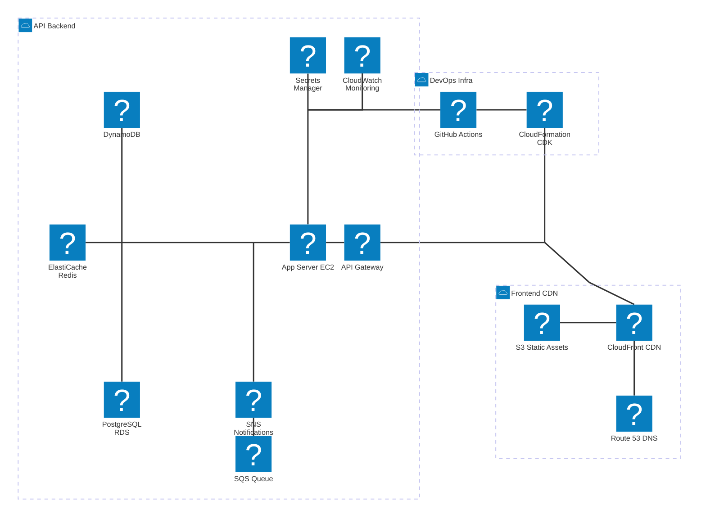

# this shit ai genrated twin

```mermaid
architecture-beta
    group api(cloud)[API Backend]

    service server(logos:aws-ec2)[App Server EC2] in api
    junction serverJunc

    service psql(logos:aws-rds)[PostgreSQL RDS] in api
    service ddb(logos:aws-dynamodb)[DynamoDB] in api
    service cache(logos:aws-elasticache)[ElastiCache Redis] in api
    junction dbJunc

    service sns(logos:aws-sns)[SNS Notifications] in api
    service sqs(logos:aws-sqs)[SQS Queue] in api
    junction snsJunc

    service secrets(logos:aws-secrets-manager)[Secrets Manager] in api
    service gate(logos:aws-api-gateway)[API Gateway] in api
    service monitor(logos:aws-cloudwatch)[CloudWatch Monitoring] in api
    junction externalJunc

    server:T -- B:serverJunc
    snsJunc:R -- L:server
    dbJunc:R -- L:snsJunc
    server:R -- L:gate

    ddb:B -- T:dbJunc
    psql:T -- B:dbJunc
    cache:R -- L:dbJunc

    externalJunc:L -- R:gate
    
    secrets:B -- T:serverJunc
    sns:T -- B:snsJunc
    sqs:T -- B:sns
    monitor:T -- R:serverJunc

    group web(cloud)[Frontend CDN]

    service s3(logos:aws-s3)[S3 Static Assets] in web
    service cloudfront(logos:aws-cloudfront)[CloudFront CDN] in web
    service route53(logos:aws-route-53)[Route 53 DNS] in web

    s3:R -- L:cloudfront
    cloudfront:T -- B:externalJunc
    route53:T -- B:cloudfront

    group devops(cloud)[DevOps Infra]
    service ci(logos:github)[GitHub Actions] in devops
    service cdk(logos:aws-cloudformation)[CloudFormation CDK] in devops

    ci:R -- L:cdk
    ci:L -- R:serverJunc
    cdk:B -- T:externalJunc
```