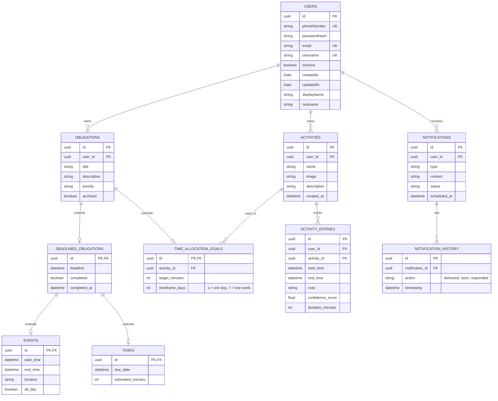
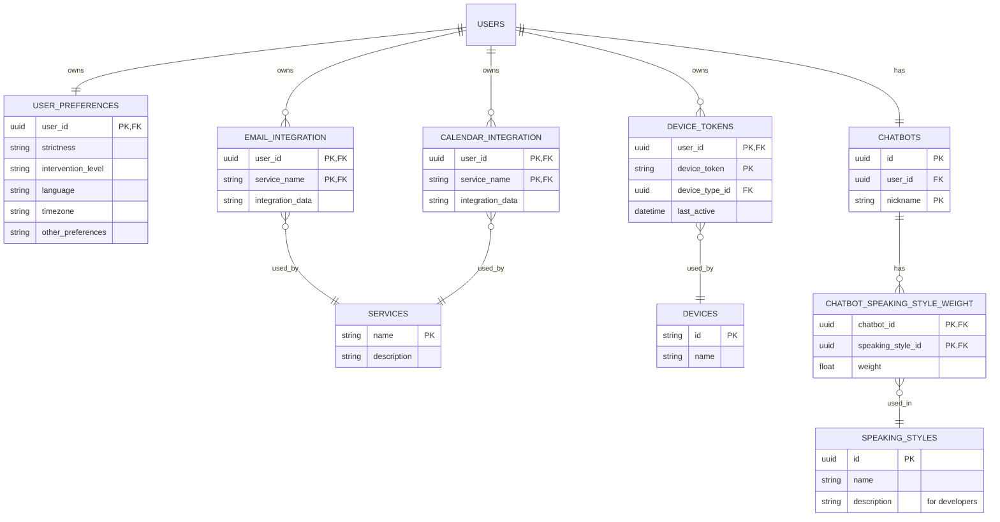

# Activity and Obligations ER Diagram

```mermaid
erDiagram
    USERS {
        uuid id PK
        string phoneNumber UK
        string passwordHash
        string email UK
        string username UK
        boolean isActive
        Date createdAt
        Date updatedAt
        string displayName
        string nickname
    }

    OBLIGATIONS {
        uuid id PK
        uuid user_id FK
        string title
        string description
        string priority
        boolean archived
    }

    DEADLINED_OBLIGATIONS {
        uuid id PK, FK
        datetime deadline
        boolean completed
        datetime completed_at
    }

    EVENTS {
        uuid id PK, FK
        datetime start_time
        datetime end_time
        string location
        boolean all_day
    }

    TASKS {
        uuid id PK, FK
        datetime due_date
        int estimated_minutes
    }

    TIME_ALLOCATION_GOALS {
        uuid id PK, FK
        uuid activity_id FK
        int target_minutes
        int timeframe_days "1 = one day, 7 = one week"
    }

    NOTIFICATIONS {
        uuid id PK
        uuid user_id FK
        string type
        string content
        string status
        datetime scheduled_at
    }

    NOTIFICATION_HISTORY {
        uuid id PK
        uuid notification_id FK
        string action "delivered, seen, responded"
        datetime timestamp
    }

    ACTIVITIES {
        uuid id PK
        uuid user_id FK
        string name
        string image
        string description
        datetime created_at
    }

    ACTIVITY_ENTRIES {
        uuid id PK
        uuid user_id FK
        uuid activity_id FK
        datetime start_time
        datetime end_time
        string note
        float confidence_score
        int duration_minutes
    }

    USERS ||--o{ OBLIGATIONS : "owns"
    USERS ||--o{ ACTIVITIES : "owns"
    ACTIVITIES ||--o{ TIME_ALLOCATION_GOALS : "used_in"
    ACTIVITIES ||--o{ ACTIVITY_ENTRIES : "tracks"
    OBLIGATIONS ||--o| DEADLINED_OBLIGATIONS : "extends"
    OBLIGATIONS ||--o| TIME_ALLOCATION_GOALS : "extends"
    DEADLINED_OBLIGATIONS ||--o| EVENTS : "extends"
    DEADLINED_OBLIGATIONS ||--o| TASKS : "extends"
    USERS ||--o{ NOTIFICATIONS : "receives"
    NOTIFICATIONS ||--o{ NOTIFICATION_HISTORY : "has"
    
```

# User Preferences & Integrations ER Diagram

```mermaid
erDiagram

%%    USER_CONTEXT {
%%        uuid id PK
%%        uuid user_id FK
%%        datetime timestamp
%%        string context_data
%%    }

    USER_PREFERENCES {
        uuid user_id PK, FK
        string strictness
        string intervention_level
        string language
        string timezone
        string other_preferences
    }

    SERVICES {
        string name PK
        string description
    }

    EMAIL_INTEGRATION {
        uuid user_id PK, FK
        string service_name PK, FK
        string integration_data
    }

    CALENDAR_INTEGRATION {
        uuid user_id PK, FK
        string service_name PK, FK
        string integration_data
    }

    DEVICE_TOKENS {
        uuid user_id PK, FK
        string device_token PK
        uuid device_type_id FK
        datetime last_active
    }

    DEVICES {
        string id PK
        string name
    }

    CHATBOTS {
        uuid id PK
        uuid user_id FK
        string nickname PK
    }

    CHATBOT_SPEAKING_STYLE_WEIGHT {
        uuid chatbot_id PK, FK
        uuid speaking_style_id PK, FK
        float weight 
    }

    SPEAKING_STYLES {
        uuid id PK
        string name
        string description "for developers"
    }
    
%%    USERS ||--o{ USER_CONTEXT : "owns"
    USERS ||--|| USER_PREFERENCES : "owns"
    USERS ||--o{ EMAIL_INTEGRATION : "owns"
    USERS ||--o{ CALENDAR_INTEGRATION : "owns"
    USERS ||--o{ DEVICE_TOKENS : "owns"
    DEVICE_TOKENS }o--|| DEVICES : "used_by"
    EMAIL_INTEGRATION }o--|| SERVICES : "used_by"
    CALENDAR_INTEGRATION }o--|| SERVICES : "used_by"

    USERS ||--|| CHATBOTS : "has"
    CHATBOTS ||--o{ CHATBOT_SPEAKING_STYLE_WEIGHT : "has"
    CHATBOT_SPEAKING_STYLE_WEIGHT }o--|| SPEAKING_STYLES : "used_in"
```