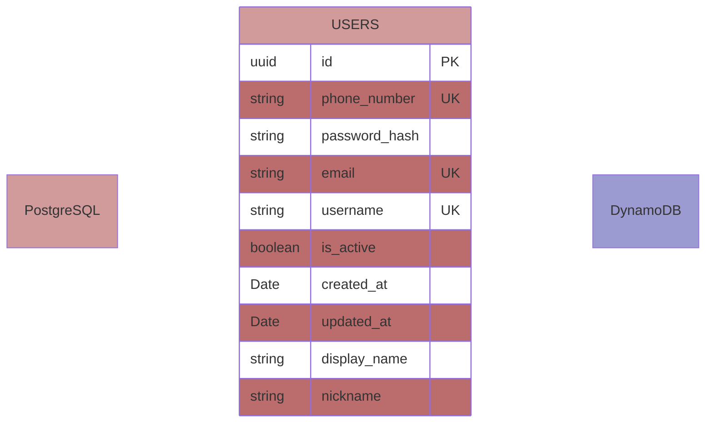
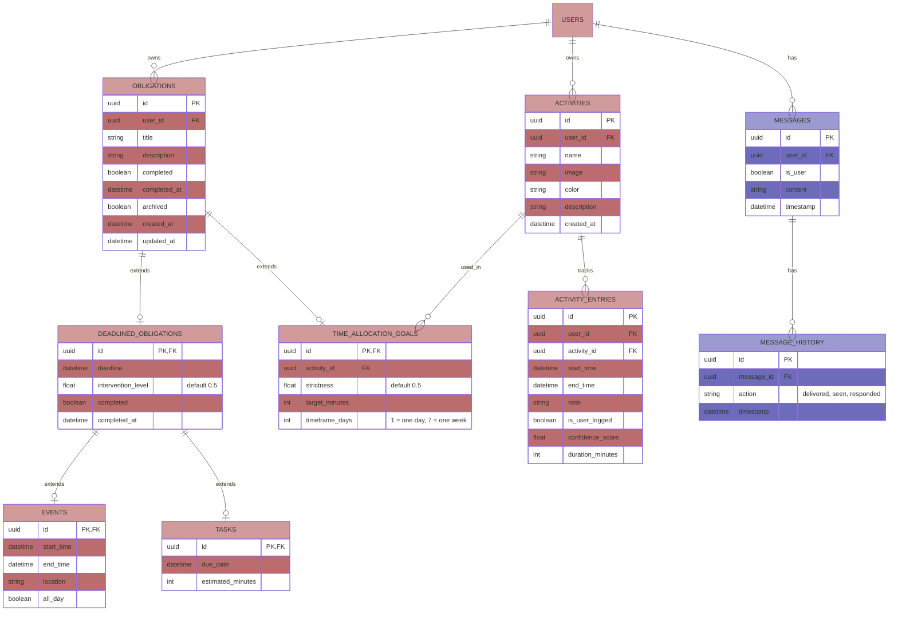
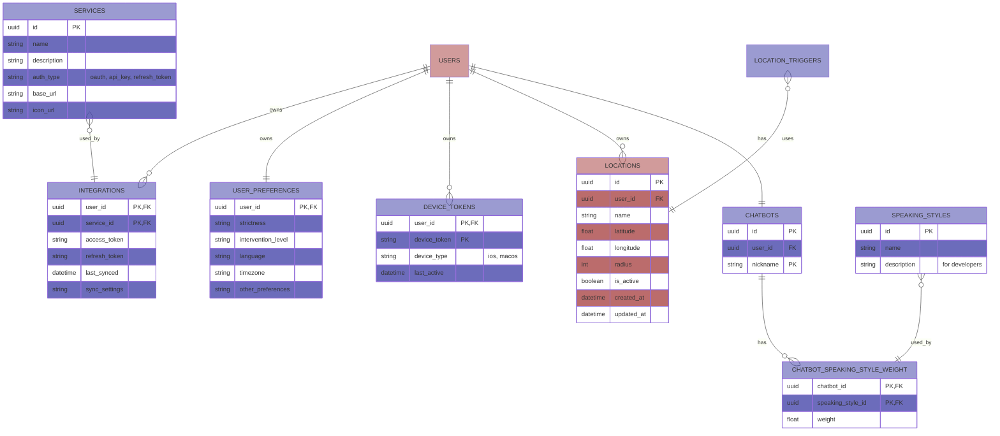
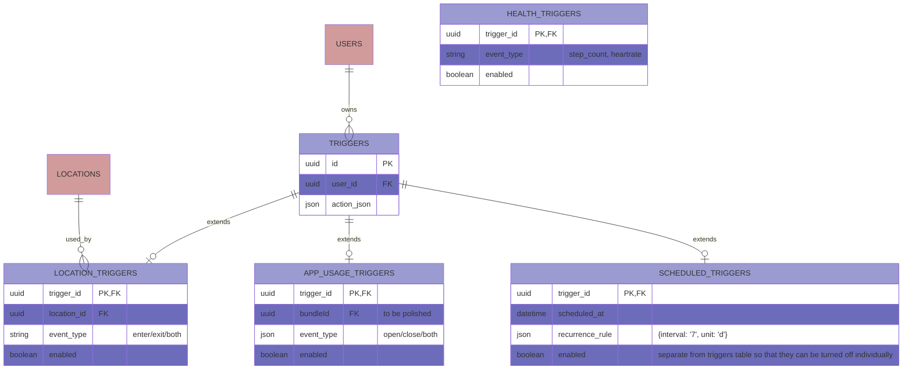

# Users Table and Key

```mermaid
erDiagram

    PostgreSQL:::postgres

    USERS:::postgres {
        uuid id PK
        string phone_number UK
        string password_hash
        string email UK
        string username UK
        boolean is_active
        Date created_at
        Date updated_at
        string display_name
        string nickname
    }

    DynamoDB:::dynamodb

    classDef postgres fill:#a448
    classDef dynamodb fill:#44a8
```
# Activity and Obligations ER Diagram

```mermaid
erDiagram
    USERS:::postgres

    OBLIGATIONS:::postgres {
        uuid id PK
        uuid user_id FK
        string title
        string description
        boolean completed
        datetime completed_at
        boolean archived
        datetime created_at
        datetime updated_at
    }

    DEADLINED_OBLIGATIONS:::postgres {
        uuid id PK, FK
        datetime deadline
        float intervention_level "default 0.5"
        boolean completed
        datetime completed_at
    }

    EVENTS:::postgres {
        uuid id PK, FK
        datetime start_time
        datetime end_time
        string location
        boolean all_day
    }

    TASKS:::postgres {
        uuid id PK, FK
        datetime due_date
        int estimated_minutes
    }

    TIME_ALLOCATION_GOALS:::postgres {
        uuid id PK, FK
        uuid activity_id FK
        float strictness "default 0.5"
        int target_minutes
        int timeframe_days "1 = one day, 7 = one week"
    }

    MESSAGES:::dynamodb {
        uuid id PK
        uuid user_id FK
        boolean is_user
        string content
        datetime timestamp
    }

    MESSAGE_HISTORY:::dynamodb {
        uuid id PK
        uuid message_id FK
        string action "delivered, seen, responded"
        datetime timestamp
    }

    ACTIVITIES:::postgres {
        uuid id PK
        uuid user_id FK
        string name
        string image
        string color
        string description
        datetime created_at
    }

    ACTIVITY_ENTRIES:::postgres {
        uuid id PK
        uuid user_id FK
        uuid activity_id FK
        datetime start_time
        datetime end_time
        string note
        boolean is_user_logged
        float confidence_score
        int duration_minutes
    }

    USERS ||--o{ OBLIGATIONS : "owns"
    USERS ||--o{ ACTIVITIES : "owns"
    ACTIVITIES ||--o{ TIME_ALLOCATION_GOALS : "used_in"
    ACTIVITIES ||--o{ ACTIVITY_ENTRIES : "tracks"
    OBLIGATIONS ||--o| DEADLINED_OBLIGATIONS : "extends"
    OBLIGATIONS ||--o| TIME_ALLOCATION_GOALS : "extends"
    DEADLINED_OBLIGATIONS ||--o| EVENTS : "extends"
    DEADLINED_OBLIGATIONS ||--o| TASKS : "extends"
    USERS ||--o{ MESSAGES : "has"
    %%MESSAGES ||--o| NOTIFICATIONS : "extends"
    %%NOTIFICATIONS ||--o| RECURRING_NOTIFICATIONS : "extends"
    %%NOTIFICATIONS }o--|| NOTIFICATION_TYPES : "used_by"
    MESSAGES ||--o{ MESSAGE_HISTORY : "has"
    
    classDef postgres fill:#a448
    classDef dynamodb fill:#44a8
```

# User Preferences & Integrations ER Diagram

```mermaid
erDiagram

%%    USER_CONTEXT {
%%        uuid id PK
%%        uuid user_id FK
%%        datetime timestamp
%%        string context_data
%%    }

    USERS:::postgres

    USER_PREFERENCES:::dynamodb {
        uuid user_id PK, FK
        string strictness
        string intervention_level
        string language
        string timezone
        string other_preferences
    }

    SERVICES:::dynamodb {
        uuid id PK
        string name
        string description
        string auth_type "oauth, api_key, refresh_token"
        string base_url
        string icon_url
    }

    INTEGRATIONS:::dynamodb {
        uuid user_id PK, FK
        uuid service_id PK, FK
        string access_token
        string refresh_token
        datetime last_synced
        string sync_settings
    }

    LOCATIONS:::postgres {
        uuid id PK
        uuid user_id FK
        string name
        float latitude
        float longitude
        int radius
        boolean is_active
        datetime created_at
        datetime updated_at
    }

    LOCATION_TRIGGERS:::dynamodb

    DEVICE_TOKENS:::dynamodb {
        uuid user_id PK, FK
        string device_token PK
        string device_type "ios, macos"
        datetime last_active
    }

    CHATBOTS:::dynamodb {
        uuid id PK
        uuid user_id FK
        string nickname PK
    }

    CHATBOT_SPEAKING_STYLE_WEIGHT:::dynamodb {
        uuid chatbot_id PK, FK
        uuid speaking_style_id PK, FK
        float weight 
    }

    SPEAKING_STYLES:::dynamodb {
        uuid id PK
        string name
        string description "for developers"
    }
    
    USERS ||--o{ INTEGRATIONS : "owns"
    USERS ||--|| USER_PREFERENCES : "owns"
    USERS ||--o{ DEVICE_TOKENS : "owns"
    SERVICES }o--|| INTEGRATIONS : "used_by"

    USERS ||--o{ LOCATIONS : "owns"
    USERS ||--|| CHATBOTS : "has"

    CHATBOTS ||--o{ CHATBOT_SPEAKING_STYLE_WEIGHT : "has"
    SPEAKING_STYLES }o--|| CHATBOT_SPEAKING_STYLE_WEIGHT : "used_by"

    LOCATION_TRIGGERS }o--|| LOCATIONS : "uses"

    classDef postgres fill:#a448
    classDef dynamodb fill:#44a8
```

```mermaid
erDiagram

    LOCATIONS:::postgres
    USERS:::postgres

    %%ACTIONS:::dynamodb {
    %%    uuid id PK
    %%    uuid user_id FK
    %%    json definition
        %%string type "start_activity, end_activity, llm_call"
        %%json edges "[{condition:'success', action_id:'act-2'}]"
        %%json payload
    %%}

    %%CONDITIONS:::dynamodb {
    %%    uuid id PK
    %%    uuid user_id FK
    %%    json definition
    %%    %%string expression "health.getLast(heartrate) < 60"
    %%}

    %%NESTED_CONDITIONS:::dynamodb {
    %%    uuid parent_cond_id FK
    %%    string type "NOT, AND, OR, XOR"
    %%    uuid l_cond_id FK
    %%    uuid r_cond_id FK
    %%}

    TRIGGERS:::dynamodb {
        uuid id PK
        uuid user_id FK
        json action_json
    %%    uuid action_id FK
    %%    uuid condition_id FK 
    }

    SCHEDULED_TRIGGERS:::dynamodb {
        uuid trigger_id PK, FK
        datetime scheduled_at
        json recurrence_rule "{interval: '7', unit: 'd'}"
        boolean enabled "separate from triggers table so that they can be turned off individually"
    }

    LOCATION_TRIGGERS:::dynamodb {
        uuid trigger_id PK, FK
        uuid location_id FK
        string event_type "enter/exit/both"
        boolean enabled
    }

    APP_USAGE_TRIGGERS:::dynamodb {
        uuid trigger_id PK, FK
        uuid bundleId FK "to be polished"
        json event_type "open/close/both"
        boolean enabled
    }

    HEALTH_TRIGGERS:::dynamodb {
        uuid trigger_id PK, FK
        string event_type "step_count, heartrate"
        boolean enabled
    }

    %%USERS ||--o{ ACTIONS : "owns"
    %%USERS ||--o{ CONDITIONS : "owns"
    USERS ||--o{ TRIGGERS : "owns"

    %%ACTIONS ||--o{ TRIGGERS : "used_by"
    %%CONDITIONS ||--o{ TRIGGERS : "used_by"
    LOCATIONS ||--o{ LOCATION_TRIGGERS : "used_by"

    TRIGGERS ||--o| LOCATION_TRIGGERS : "extends"
    TRIGGERS ||--o| APP_USAGE_TRIGGERS : "extends"
    TRIGGERS ||--o| SCHEDULED_TRIGGERS : "extends"

    %%CONDITIONS ||--o| NESTED_CONDITIONS : "extends"
    %%NESTED_CONDITIONS ||--o| NESTED_CONDITIONS : "uses"


    classDef postgres fill:#a448
    classDef dynamodb fill:#44a8
```