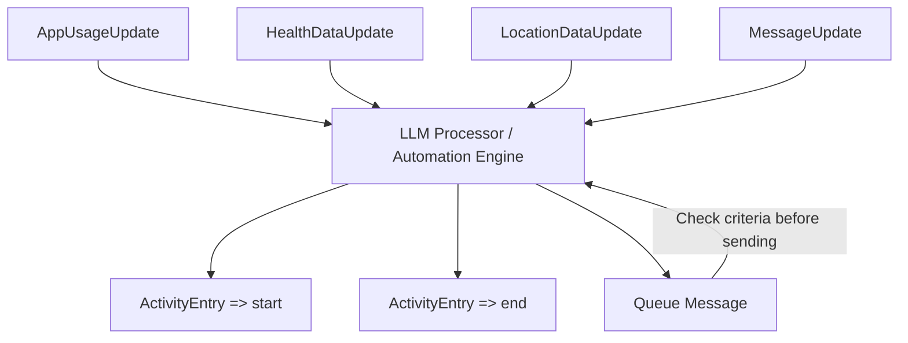

# LangChain Event Automation Flow

This document describes how the Jiko backend processes incoming events and uses an LLM to trigger activities or messages based on dynamic rules.

## Event Sources

* **AppUsageUpdate**: Records app usage metrics, sessions, foreground/background states.
* **HealthDataUpdate**: Includes step counts, heart rate, and other health metrics.
* **LocationDataUpdate**: Provides GPS updates.
* **MessageUpdate (internal)**: System-generated messages that may trigger automations.

## LLM Processor / Automation Engine

* Receives all event nodes.

* Evaluates attributes and edges.

* Decides which actions to trigger:

  * `ActivityEntry.start()`
  * `ActivityEntry.end()`
  * Queued messages based on criteria.

* Supports recursive automations:

  * Messages can contain conditions that feed back into the LLM.
  * Example: "When < 10000 steps logged at noon, queue a message".

## Queued Messages with Criteria

* Each queued message contains a **criteria function** to prevent sending after the condition is satisfied.
* Allows complex conditional automation without spamming users.

Example:

```ts
const queuedMessage: QueuedMessage = {
  id: "msg_001",
  recipientId: "user_001",
  message: "Keep walking!",
  criteria: (state) => state.steps < 10000
}
```

* LLM checks `criteria(currentState)` before sending the message.

## Summary

* All events flow into the LLM processor.
* Actions (ActivityEntry, messages) are triggered based on dynamic rules.
* Recursive automations enable flexible, condition-based workflows.
* Using a graph/node structure helps track dependencies between events, activities, and messages.

This flowchart and structure can be integrated into your Mermaid-based documentation for Jiko.
