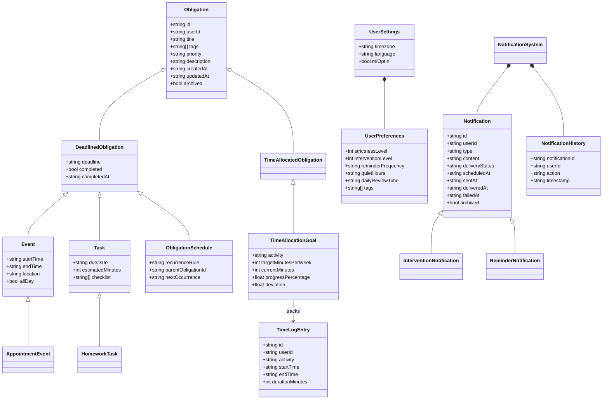
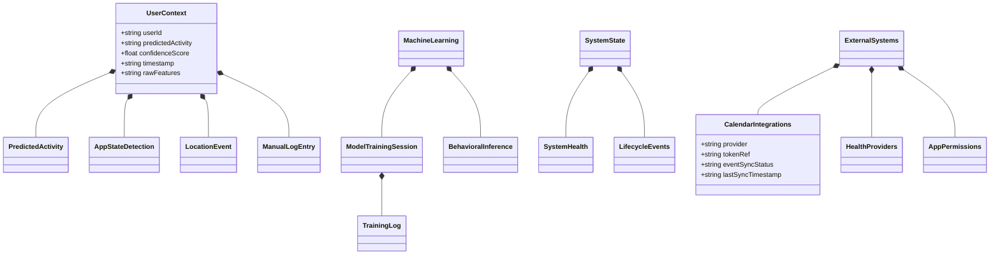

# Obligations Type Relationships

## Overview
This document outlines the hierarchy and relationships between all types defined in the obligations schema. These types form the core structure of Jiko’s task, event, scheduling, user management, machine learning, and integration systems.

---

## Base Types
- **ID** → `string (uuid)`
- **ISODateTime** → `string (ISO 8601 format)`
- **TagArray** → `string[]`

These are primitive building blocks reused across all other types.

---

## Obligation Hierarchy

```
Obligation
│
├── DeadlinedObligation
│   │
│   ├── Event
│   │   └── AppointmentEvent (extends Event)
│   ├── Task
│   │   └── HomeworkTask (extends Task)
│   └── ObligationSchedule
│
├── TimeAllocatedObligation
│   ├── TimeAllocationGoal
│   │   └── TimeLogEntry
│
└── AbstractObligation (base class for all types)
```

### Obligation
- **Base entity** representing any responsibility.
- Fields: `id`, `userId`, `title`, `description?`, `priority`, `tags`, `createdAt`, `updatedAt?`, `archived`.

### DeadlinedObligation
- Extends **Obligation**
- Adds time-based and completion tracking:
  - `deadline`
  - `completed`
  - `completedAt?`

### Event
- Extends **DeadlinedObligation**
- Adds calendar-specific fields:
  - `startTime`, `endTime?`, `location?`, `allDay`

### AppointmentEvent
- Extends **Event**
- Represents specific appointment-related data and behaviors.

### Task
- Extends **DeadlinedObligation**
- Adds task-specific fields:
  - `dueDate` (alias for `deadline`)
  - `estimatedMinutes?`
  - `checklist?` (array of subtasks)

### HomeworkTask
- Extends **Task**
- Specialized task for homework-related tracking and metadata.

### ObligationSchedule
- Extends **DeadlinedObligation**
- Adds recurrence and linking:
  - `recurrenceRule`
  - `parentObligationId?`
  - `nextOccurrence?`

### TimeAllocatedObligation
- Extends **Obligation**
- Related to obligations with explicit time allocation.

### TimeAllocationGoal
- Extends **TimeAllocatedObligation**
- Defines goals related to time use.
- Fields: `id`, `userId`, `activity`, `targetMinutesPerWeek`, `currentMinutes`, `progressPercentage`, `deviation`.

### TimeLogEntry
- Supports goal tracking.
- Fields: `id`, `userId`, `activity`, `startTime`, `endTime`, `durationMinutes`.

---

## User and Personalization

### UserSettings
- Aggregates user configuration.
- Fields: `timezone`, `language`, `mlOptIn`, and optional `preferences`.

### UserPreferences
- Defines per-user behavioral tuning.
- Fields: `strictnessLevel`, `interventionLevel`, `reminderFrequency`, `quietHours`, `dailyReviewTime?`, `tags?`.

Relationship:
```
UserSettings
└── includes → UserPreferences
```

### UserLifecycle
- Tracks user engagement stages, onboarding status, and lifecycle events.

### AppUsageIntegration
- Captures data from app usage monitoring and analytics.

### HealthData
- Integrates health-related metrics and data sources.

### MLIntegration
- Optional opt-in machine learning features and models for personalization.

---

## Notification System

```
NotificationSystem
├── Notification
│   ├── InterventionNotification (priority-based)
│   └── ReminderNotification (simple reminders)
└── NotificationHistory
```

### Notification
- Represents a sent or scheduled message.
- Fields: `id`, `userId`, `type`, `content`, `deliveryStatus`, `scheduledAt`, `sentAt?`, `deliveredAt?`, `failedAt?`, `archived`.

### InterventionNotification
- Extends **Notification**
- Priority-based notifications for user intervention.

### ReminderNotification
- Extends **Notification**
- Simple reminder messages.

### NotificationHistory
- Logs user interaction with a given notification.
- Fields: `notificationId`, `userId`, `action`, `timestamp`.

---

## User Context and Intelligence

### UserContext
- Captures real-time or predicted state of the user.
- Fields: `userId`, `predictedActivity?`, `confidenceScore`, `timestamp`, `rawFeatures?`.

### PredictedActivity
- Represents inferred user activities based on context and ML models.

### AppStateDetection
- Detects current application state and user interaction modes.

### LocationEvent
- Tracks location-based events and geofencing triggers.

### ManualLogEntry
- User-entered manual logs for activities or context.

---

## Machine Learning

```
MachineLearning
├── ModelTrainingSession
│   └── TrainingLog
└── BehavioralInference
```

### ModelTrainingSession
- Manages training sessions for ML models.

### TrainingLog
- Audit logs for model updates and training events.

### BehavioralInference
- AI-driven context detection and behavior prediction.

---

## System State and Monitoring

```
SystemState
├── SystemHealth
└── LifecycleEvents
```

### SystemHealth
- Monitors system performance, errors, and uptime.

### LifecycleEvents
- Analytics on system and user lifecycle events.

---

## External Systems and Integrations

```
ExternalSystems
├── CalendarIntegrations
├── HealthProviders
└── AppPermissions
```

### CalendarIntegrations
- Manages connected calendar providers such as Google Calendar and iCal.
- Fields: `provider`, `tokenRef?`, `eventSyncStatus`, `lastSyncTimestamp?`.

### HealthProviders
- Integrates with health data providers like Apple Health and Google Fit.

### AppPermissions
- Manages device-level access for usage tracking and permissions.

---

## Relationship Summary

| Parent Type           | Child / Related Types                                         | Relationship   |
|-----------------------|--------------------------------------------------------------|----------------|
| Obligation            | DeadlinedObligation, TimeAllocatedObligation, AbstractObligation | Inheritance    |
| DeadlinedObligation   | Event, Task, ObligationSchedule                               | Inheritance    |
| Event                 | AppointmentEvent                                             | Inheritance    |
| Task                  | HomeworkTask                                                | Inheritance    |
| TimeAllocatedObligation | TimeAllocationGoal                                          | Inheritance    |
| TimeAllocationGoal    | TimeLogEntry                                                 | One-to-many    |
| UserSettings          | UserPreferences                                              | Composition    |
| NotificationSystem    | Notification, NotificationHistory                             | Composition    |
| Notification          | InterventionNotification, ReminderNotification               | Inheritance    |
| UserContext           | PredictedActivity, AppStateDetection, LocationEvent, ManualLogEntry | Composition    |
| MachineLearning       | ModelTrainingSession, BehavioralInference                    | Composition    |
| ModelTrainingSession  | TrainingLog                                                  | Composition    |
| SystemState           | SystemHealth, LifecycleEvents                                | Composition    |
| ExternalSystems       | CalendarIntegrations, HealthProviders, AppPermissions        | Composition    |
| CalendarIntegrations  | Event (indirect synchronization)                             | Synchronization|

---

## Diagram Summary

```
Root
├── User
│   ├── UserSettings
│   │   ├── UserPreferences
│   │   ├── UserLifecycle
│   │   ├── CalendarIntegrations
│   │   ├── AppUsageIntegration
│   │   ├── HealthData
│   │   └── MLIntegration (optional opt-in)
│   │
│   ├── Obligation (Interface)
│   │   ├── DeadlinedObligation
│   │   │   ├── Task
│   │   │   │   └── HomeworkTask (extends Task)
│   │   │   ├── Event
│   │   │   │   └── AppointmentEvent (extends Event)
│   │   │   └── ObligationSchedule (recurring obligations)
│   │   │
│   │   ├── TimeAllocatedObligation
│   │   │   ├── TimeAllocationGoal
│   │   │   │   └── TimeLogEntry (manual/auto logs)
│   │   │
│   │   └── AbstractObligation (base class for all types)
│   │
│   ├── NotificationSystem
│   │   ├── Notification
│   │   │   ├── InterventionNotification (priority-based)
│   │   │   └── ReminderNotification (simple reminders)
│   │   └── NotificationHistory (archived logs)
│   │
│   ├── UserContext
│   │   ├── PredictedActivity
│   │   ├── AppStateDetection
│   │   ├── LocationEvent
│   │   └── ManualLogEntry
│   │
│   ├── MachineLearning
│   │   ├── ModelTrainingSession
│   │   │   └── TrainingLog (audit for model updates)
│   │   └── BehavioralInference (AI-driven context detection)
│   │
│   └── SystemState
│       ├── SystemHealth (monitoring)
│       └── LifecycleEvents (analytics)
└── ExternalSystems (cross-cutting)
    ├── CalendarIntegrations (Google, iCal)
    ├── HealthProviders (Apple Health, Google Fit)
    └── AppPermissions (device-level access for usage tracking)
```

---
This document serves as the comprehensive reference for understanding type inheritance and logical connections between entities within the obligations module and its extended ecosystem.

## UML Diagram


