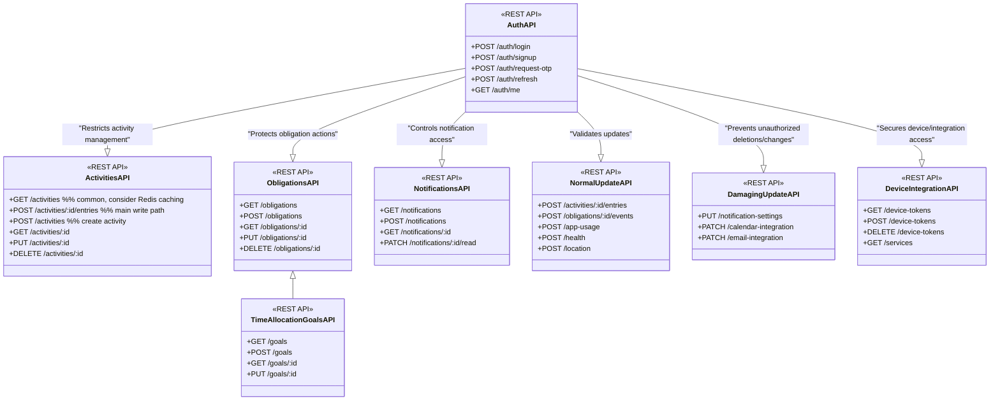

```mermaid
classDiagram
    %% Authentication layer
    class AuthAPI {
        <<REST API>>
        +POST /auth/login
        +POST /auth/signup
        +POST /auth/request-otp
        +POST /auth/refresh 
        +GET /auth/me
        %% +DELETE /auth/logout
    }

    %% User management
    %% class UsersAPI {
    %%    <<REST API>>
    %%    +GET /users
    %%    +POST /users
    %%    +GET /users/:id
    %%    +PUT /users/:id  
    %%    +DELETE /users/:id
    %%}

    %% Activities
    class ActivitiesAPI {
        <<REST API>>
        %% Hot endpoints (frequently used)
        +GET /activities                    %% common, consider Redis caching
        +POST /activities/:id/entries       %% main write path
        +POST /activities                   %% create activity

        %% Rare endpoints
        +GET /activities/:id
        +PUT /activities/:id
        +DELETE /activities/:id
    }

    %% Obligations
    class ObligationsAPI {
        <<REST API>>
        +GET /obligations
        +POST /obligations
        +GET /obligations/:id
        +PUT /obligations/:id
        +DELETE /obligations/:id
    }

    %% Notifications
    class NotificationsAPI {
        <<REST API>>
        +GET /notifications
        +POST /notifications
        +GET /notifications/:id
        +PATCH /notifications/:id/read
    }

    %% Time Allocation Goals
    class TimeAllocationGoalsAPI {
        <<REST API>>
        +GET /goals
        +POST /goals
        +GET /goals/:id
        +PUT /goals/:id
    }

    %% Normal updates
    class NormalUpdateAPI {
        <<REST API>>
        +POST /activities/:id/entries
        +POST /obligations/:id/events
        +POST /app-usage
        +POST /health
        +POST /location
    }

    %% Damaging updates (destructive changes)
    class DamagingUpdateAPI {
        <<REST API>>
        +PUT /notification-settings
        +PATCH /calendar-integration
        +PATCH /email-integration
    }

    %% Device & integrations
    class DeviceIntegrationAPI {
        <<REST API>>
        +GET /device-tokens
        +POST /device-tokens
        +DELETE /device-tokens
        +GET /services
    }

    %% Relationships
    %% AuthAPI --|> UsersAPI : "Authenticates user operations"
    AuthAPI --|> ObligationsAPI : "Protects obligation actions"
    AuthAPI --|> NotificationsAPI : "Controls notification access"
    AuthAPI --|> ActivitiesAPI : "Restricts activity management"
    AuthAPI --|> DeviceIntegrationAPI : "Secures device/integration access"
    AuthAPI --|> NormalUpdateAPI : "Validates updates"
    AuthAPI --|> DamagingUpdateAPI : "Prevents unauthorized deletions/changes"
    ObligationsAPI <|-- TimeAllocationGoalsAPI
```