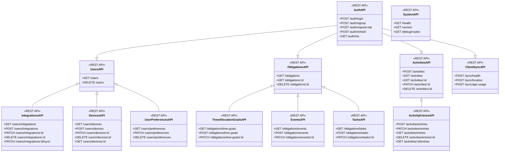

# V1 API

```mermaid
classDiagram
    %% Authentication layer
    class AuthAPI {
        <<REST API>>
        +POST /auth/login
        +POST /auth/signup
        +POST /auth/request-otp
        +POST /auth/refresh 
        +GET /auth/me
        %% +DELETE /auth/logout
    }

    %% Users layer
    class UsersAPI {
        <<REST API>>
        +GET /users
        +DELETE /users
    }

    %% User Preferences layer
    class UserPreferencesAPI {
        <<REST API>>
        +GET /users/preferences
        +PATCH /users/preferences
        +DELETE /users/preferences
    }

    %% Devices layer
    class DevicesAPI {
        <<REST API>>
        +GET /users/devices
        +POST /users/devices
        +PATCH /users/devices/:id
        +DELETE /users/devices/:id

        +GET /users/devices/:id
    }

    %% Integration Management APIs
    class IntegrationsAPI {
        <<REST API>>
        +GET /users/integrations
        +POST /users/integrations
        +PATCH /users/integrations/:id
        +DELETE /users/integrations/:id
        +PATCH /users/integrations/:id/sync
    }

    %% Activities
    class ActivitiesAPI {
        <<REST API>>
        +POST /activities
        +GET /activities

        +GET /activities/:id
        +PATCH /activities/:id
        +DELETE /activities/:id
    }

    class ActivityEntriesAPI {
        <<REST API>>
        +POST /activities/entries
        +PATCH /activities/entries
        +GET /activities/entries
        
        +DELETE /activities/entries/:id

        +GET /activities/:id/entries
    }

    %% Obligations
    class ObligationsAPI {
        <<REST API>>
        +GET /obligations
        +GET /obligations/:id
        +DELETE /obligations/:id
    }

    class TimeAllocationGoalsAPI {
        <<REST API>>
        +GET /obligations/time-goals
        +POST /obligations/time-goals
        +PATCH /obligations/time-goals/:id
    }
    
    class EventsAPI {
        <<REST API>>
        +GET /obligations/events
        +POST /obligations/events
        +PATCH /obligations/events/:id
    }

    class TasksAPI {
        <<REST API>>
        +GET /obligations/tasks
        +POST /obligations/tasks
        +PATCH /obligations/tasks/:id
    }

    %% Notifications
    %%class NotificationsAPI {
    %%    <<REST API>>
    %%    +GET /notifications
    %%    +POST /notifications
    %%    +GET /notifications/:id
    %%    +PATCH /notifications/:id/read
    %%}

    %% Meta & System
    class SystemAPI {
        <<REST API>>
        +GET /health
        +GET /version
        +GET /debug/routes
    }

    %% Sync APIs
    class ClientSyncAPI {
        <<REST API>>
        +POST /sync/health
        +POST /sync/location
        +POST /sync/app-usage
    }

    %% Relationships
    AuthAPI --|> UsersAPI
    AuthAPI --|> ObligationsAPI
    AuthAPI --|> ActivitiesAPI
    ActivitiesAPI <|-- ActivityEntriesAPI
    AuthAPI --|> ClientSyncAPI
    UsersAPI <|-- IntegrationsAPI
    UsersAPI <|-- DevicesAPI
    UsersAPI <|-- UserPreferencesAPI
    ObligationsAPI <|-- TimeAllocationGoalsAPI
    ObligationsAPI <|-- EventsAPI
    ObligationsAPI <|-- TasksAPI
```